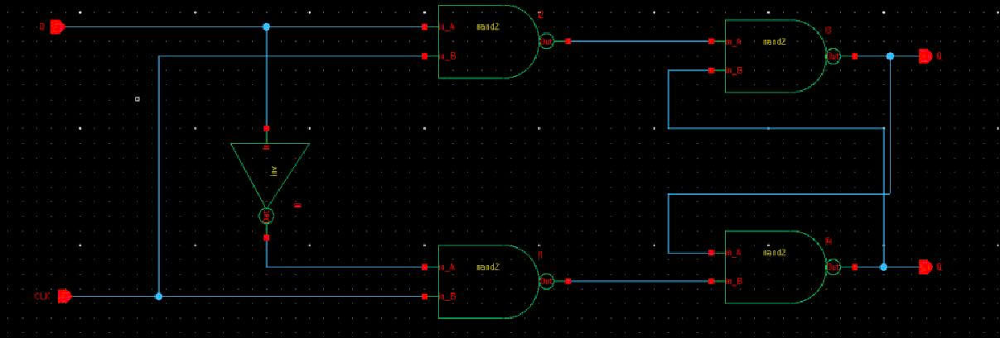
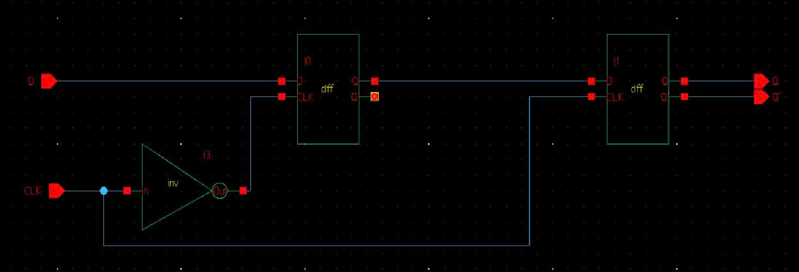
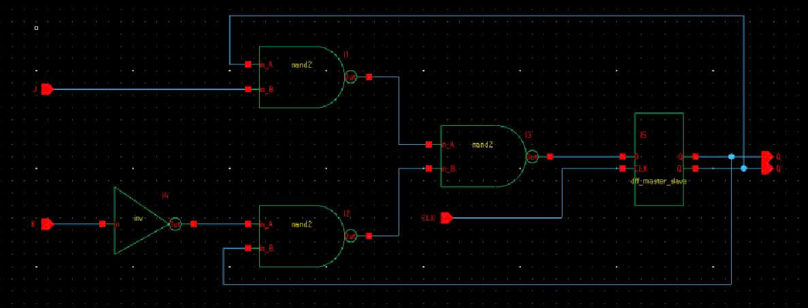
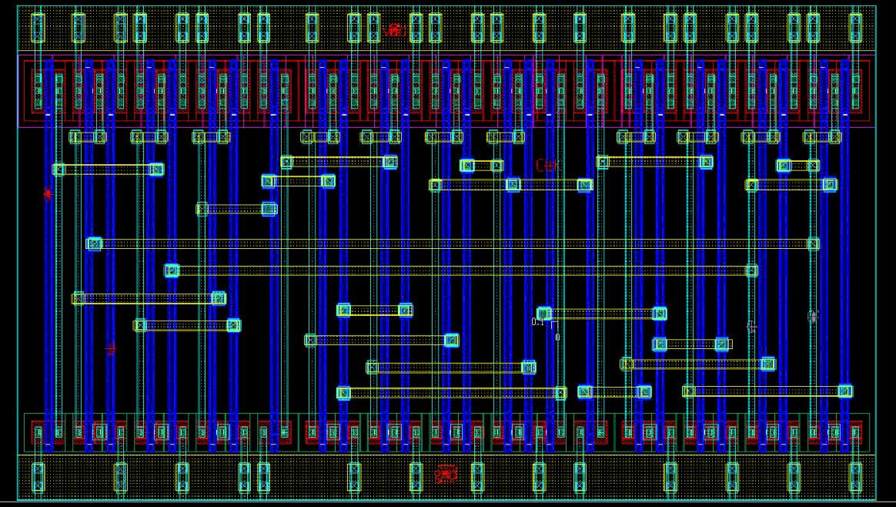
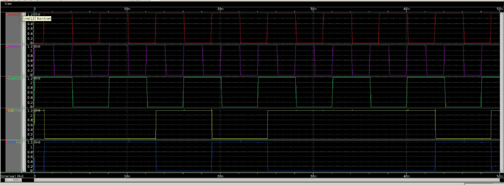
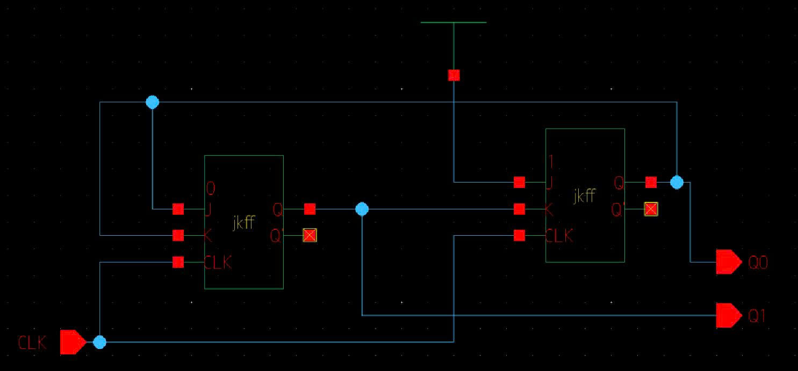
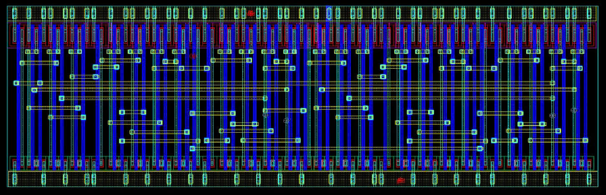
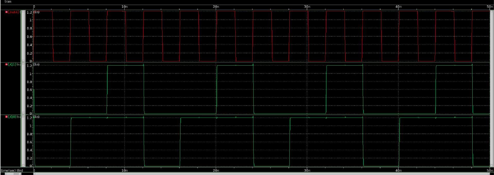

# CMOS JK Flip-Flop and 2-bit Synchronous Counter Design 

## 📌 Overview

This project presents the transistor-level design of a CMOS JK Flip-Flop and a 2-bit synchronous modulo-4 counter.

The design flow consists of:

1. Designing a D Latch.
2. Constructing a D Flip-Flop from D Latches.
3. Implementing a JK Flip-Flop using the designed D Flip-Flop and NAND2-based logic.
4. Designing a 2-bit synchronous binary counter using the custom JK Flip-Flops.
5. Verifying functionality through schematic simulation and custom layout implementation.

The counter follows the sequence:

00 → 01 → 11 → 00 → ...

---

## 🔹 D Latch Design

### Schematic

---

## 🔹 D Flip-Flop Design

### Schematic

The D Flip-Flop was constructed using D Latches and serves as the storage element for the JK Flip-Flop design.

---

## 🔹 JK Flip-Flop Design

### Schematic

### Layout

### Functional Simulation

The JK Flip-Flop was implemented using the previously designed D Flip-Flop and NAND2 logic based on De Morgan's theorem.

---

## 🔹 2-bit Synchronous Counter Design

The counter is implemented using two custom JK Flip-Flops.

### Counting Sequence

| Current State | Next State |
|--------------|------------|
| 00 | 01 |
| 01 | 11 |
| 10 | 11 |
| 11 | 00 |

### Schematic

### Layout

### Functional Simulation

---

## 📌 Key Learnings

- CMOS sequential circuit design
- D Latch and D Flip-Flop implementation
- JK Flip-Flop realization using NAND2 gates
- Full-custom layout design in 90nm technology
- Synchronous counter design
- Functional verification through waveform simulation
